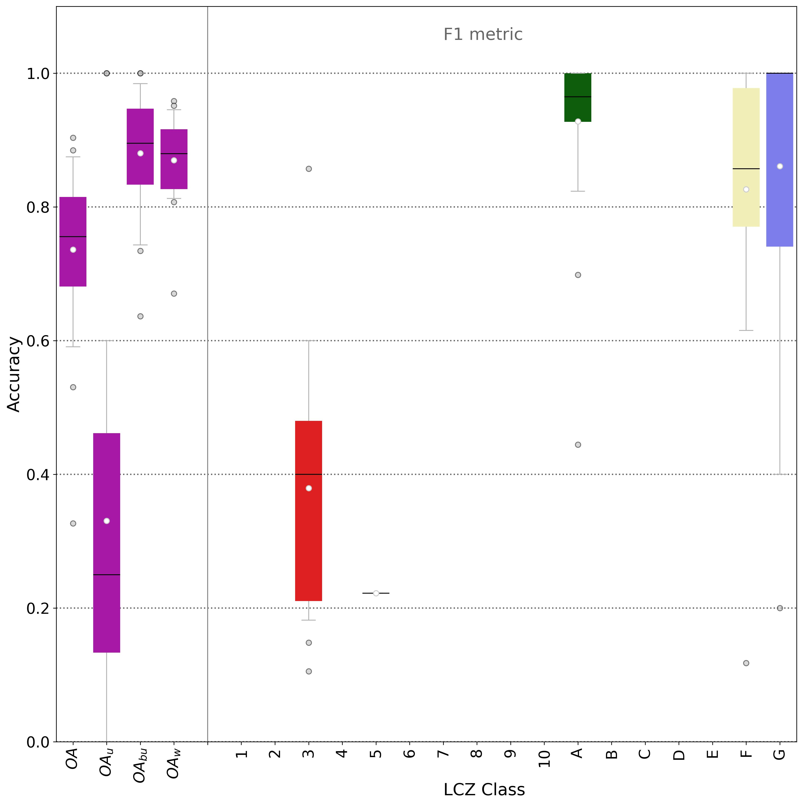
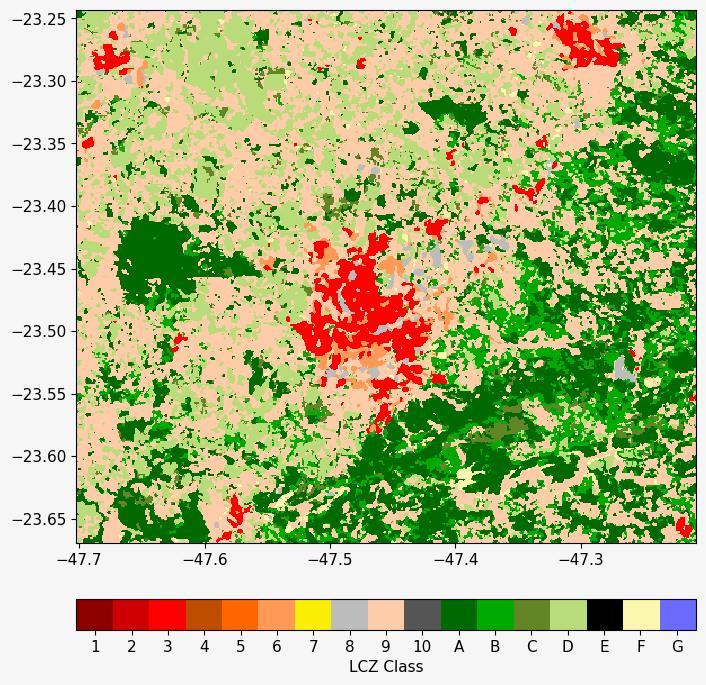
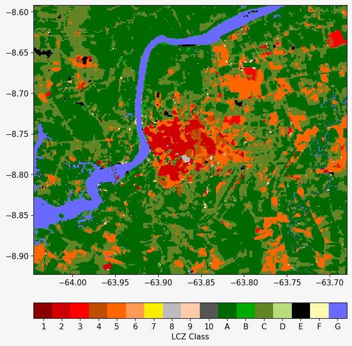
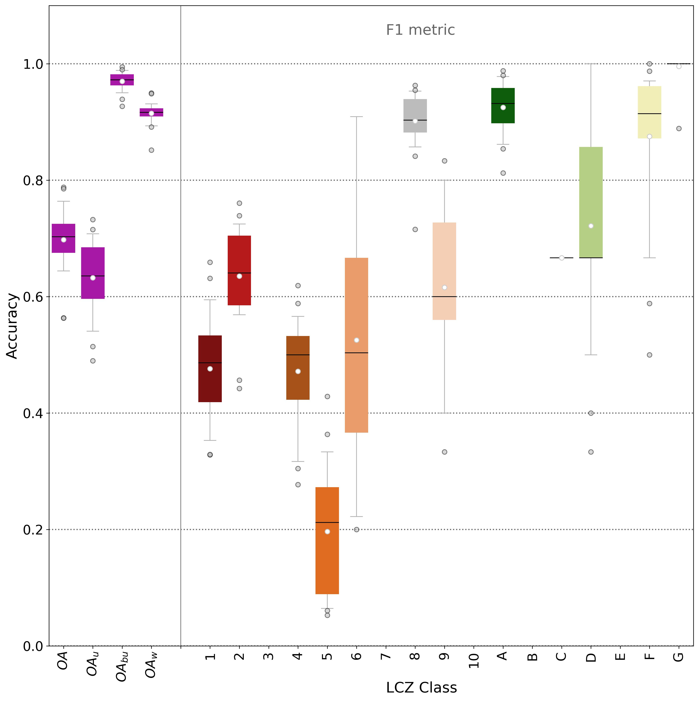

# Modification of the Test-Train split algorithm

## Description of the changes

With version 2.5.0 of the LCZ-Generator a change was made to the way the test-train
split works. Previously, a simpler approach was taken, splitting the entire Training
Area (TA) dataset randomly into 70% training data and 30% test data. This was done 25
times, each time shuffling the dataset. The split was achieved by creating a uniform
distribution between 0 and 1, assigning a number to each polygon, and finally only
selecting numbers &leq; 0.7. While in the best case all LCZ-classes should have a
similar number of TA, this is not always the case, making it necessary to stratify each
split by the LCZ-class. This improvement was implemented in version 2.5.0, utilizing the
[`train_test_split`](https://scikit-learn.org/1.5/modules/generated/sklearn.model_selection.train_test_split.html)
function from the scikit-learn package and performing the split offline. During this
process, a set of new columns, named after the random seed used during the split, is
added. One column for each bootstrap that will be performed is added, resulting in a new
file structure with 25 columns, each marking test data as `0` and train data as `1`.

| Class | id                                       | 1   | 2   | ... | 24  | 25  |
| ----- | ---------------------------------------- | --- | --- | --- | --- | --- |
| 1     | 2c21afdb592c068a547f2cb91a3676ffea44de6d | 1   | 0   | ... | 1   | 0   |
| 1     | 53e09dcf25a0399910aa0b220b803a3324f12a24 | 0   | 1   |     | 0   | 1   |
| ...   |                                          | ... | ... | ... | ... | ... |
| 17    | fc59e7bd60c3c3bb8551c22182bcf9f27c8b6c85 | 1   | 0   | ... | 1   | 0   |
| 17    | ad8af06c53a50e642ae6b937ac305b9f78961a3a | 0   | 1   | ... | 0   | 1   |

During the classification process within Google Earth-Engine, for each bootstrap, a
different column is used. Resulting in 25 individual classification with different set
of test- and training data. Previously, there were cases, where a single class was not
present in either test- or training data.

## Investigating the impact of the changes

To investigate the impact of the implemented changes on the classification process, a
random set of TAs was derived from the LCZ-Generator database. Following a set of
criterions. To assess the impact on different sizes of TA-datasets, three categories of
TAs were implemented, _low_ number of TAs, _medium_ number of TAs, and _high_ number of
TAs. Two metrics were used, 1. the total number of TAs in the dataset, 2. the overall
number of LCZ-classes present in the TA-dataset. For the _low_ category, only TA
datasets were selected that were between the 1st and 20th percentile of all TA datasets.
For the _medium_ category, only TA datasets between the 40th and 60th percentile were
selected, for the _high_ category, TAs between the 80th and 99th percentile were
selected. Using this method, three subsets of potential candidates were retrieved from
the LCZ-Generator database. A few additional criterions were added, where one of the LCZ
classes present had to have exactly three TAs, since we believed the impact would be
highest at this size, all other had to have three or more samples. Overall accuracy had
to be between 0.45 and 0.85, to exclude arbitrarily high sets of TA and very poor sets
of TAs. Finally, a single TA-dataset was randomly selected from each category (_low_,
_medium_, _high_), and if possible, one per continent.

## Processing

All selected TA-datasets were processed locally using the new algorithm and the results
were visually compared against each other via the boxplot figure of accuracies, the plot
of the classified map, and a visualization of the test-train split.

## Results

Results indicate, that the impact is generally low. The impact on TA datasets with a
lower number fo TAs is higher than for datasets with a high number of TAs.

| City                     | category | $N_{classes}$ | $N_{total}$ | $oa_{unif}$ | $oa_{stratif}$ | $oau_{unif}$ | $oau_{stratif}$ | $oabu_{unif}$ | $oabu_{stratif}$ | $oaw_{unif}$ | $oaw_{stratif}$ |
| :----------------------- | :------- | ------------: | ----------: | ----------: | -------------: | -----------: | --------------: | ------------: | ---------------: | -----------: | --------------: |
| Sundargarh               | low      |             5 |          30 |       0.686 |          0.736 |         0.28 |           0.331 |         0.852 |             0.88 |         0.84 |            0.87 |
| Tunis                    | low      |             9 |          39 |       0.503 |          0.561 |        0.361 |           0.386 |         0.925 |            0.924 |        0.882 |           0.893 |
| Dresden                  | low      |             9 |          41 |       0.843 |          0.899 |        0.827 |           0.885 |          0.96 |            0.984 |        0.958 |           0.979 |
| SAN NICOLAS DE LOS GARZA | low      |             6 |          67 |       0.691 |          0.704 |        0.808 |           0.812 |         0.905 |            0.907 |        0.921 |            0.92 |
| Sorocaba                 | low      |             9 |          75 |       0.735 |          0.737 |        0.892 |           0.886 |         0.837 |            0.844 |        0.917 |           0.921 |
| Thessaloniki             | medium   |            15 |         126 |        0.63 |          0.679 |         0.59 |           0.642 |         0.916 |            0.929 |        0.914 |           0.928 |
| Melbourne                | medium   |            15 |         128 |        0.66 |          0.688 |        0.694 |            0.72 |         0.875 |            0.893 |        0.918 |           0.927 |
| Porto Velho              | medium   |            14 |         139 |        0.77 |          0.806 |        0.412 |           0.494 |         0.982 |            0.978 |         0.93 |           0.936 |
| College Station          | medium   |            15 |         152 |       0.606 |          0.605 |        0.486 |           0.486 |         0.892 |            0.885 |        0.886 |           0.885 |
| CAIRO V8                 | medium   |            15 |         192 |       0.724 |          0.728 |        0.729 |           0.762 |         0.893 |            0.898 |         0.89 |            0.89 |
| changsha                 | medium   |            14 |         201 |       0.702 |          0.698 |        0.624 |           0.633 |         0.973 |             0.97 |        0.917 |           0.915 |
| 郑州                     | high     |            16 |         926 |       0.629 |          0.635 |        0.649 |           0.661 |         0.966 |            0.958 |        0.869 |           0.868 |
| Iași                     | high     |            17 |         928 |       0.593 |          0.593 |        0.472 |           0.452 |         0.901 |            0.905 |        0.889 |           0.888 |

### Sundargarh, India, Republic of. Asia ([LCZ-Generator](https://lcz-generator.rub.de/factsheets/949c5c4f7926461a1de02cbd33f862a5c4474cf7/949c5c4f7926461a1de02cbd33f862a5c4474cf7_factsheet.html))

Training areas submitted to the LCZ-Generator by: Aarav Singh.

| before                                                               | after                                                                   |
| :------------------------------------------------------------------- | :---------------------------------------------------------------------- |
| **N:** 30                                                            | **N:** 30                                                               |
| **Nr. classes:** 5                                                   | **Nr. classes** 5                                                       |
| **Sample Size Class:** low                                           | **Sample Size Class:** low                                              |
| **$OA$:** 0.686                                                      | **$OA$:** 0.736                                                         |
| **$OA_u$:** 0.280                                                    | **$OA_u$:** 0.331                                                       |
| **$OA_{bu}$:** 0.852                                                 | **$OA_{bu}$:** 0.880                                                    |
| **$OA_w$:** 0.840                                                    | **$OA_w$:** 0.870                                                       |
|   |   |
|  |  |
|         |         |

### Tunis, Tunisia, Tunisian Republic. Africa ([LCZ-Generator](https://lcz-generator.rub.de/factsheets/c3baae1826c8857042d3f1d430d5daa7be745eb0/c3baae1826c8857042d3f1d430d5daa7be745eb0_factsheet.html))

Training areas submitted to the LCZ-Generator by: Narimene Jday.

| before                                                               | after                                                                   |
| :------------------------------------------------------------------- | :---------------------------------------------------------------------- |
| **N:** 39                                                            | **N:** 39                                                               |
| **Nr. classes:** 9                                                   | **Nr. classes** 9                                                       |
| **Sample Size Class:** low                                           | **Sample Size Class:** low                                              |
| **$OA$:** 0.503                                                      | **$OA$:** 0.561                                                         |
| **$OA_u$:** 0.361                                                    | **$OA_u$:** 0.386                                                       |
| **$OA_{bu}$:** 0.925                                                 | **$OA_{bu}$:** 0.924                                                    |
| **$OA_w$:** 0.882                                                    | **$OA_w$:** 0.893                                                       |
|   |   |
|  |  |
|         |         |

### Dresden, Germany, Federal Republic of. Europe ([LCZ-Generator](https://lcz-generator.rub.de/factsheets/de60eb10ab3783a698a60724d09f679b70ff1d20/de60eb10ab3783a698a60724d09f679b70ff1d20_factsheet.html))

Training areas submitted to the LCZ-Generator by: Amir Raoufi.

| before                                                               | after                                                                   |
| :------------------------------------------------------------------- | :---------------------------------------------------------------------- |
| **N:** 41                                                            | **N:** 41                                                               |
| **Nr. classes:** 9                                                   | **Nr. classes** 9                                                       |
| **Sample Size Class:** low                                           | **Sample Size Class:** low                                              |
| **$OA$:** 0.843                                                      | **$OA$:** 0.899                                                         |
| **$OA_u$:** 0.827                                                    | **$OA_u$:** 0.885                                                       |
| **$OA_{bu}$:** 0.960                                                 | **$OA_{bu}$:** 0.984                                                    |
| **$OA_w$:** 0.958                                                    | **$OA_w$:** 0.979                                                       |
|   |   |
|  |  |
|         |         |

### SAN NICOLAS DE LOS GARZA, Mexico, United Mexican States. North America ([LCZ-Generator](https://lcz-generator.rub.de/factsheets/c40d871420ff698d54489a70568df4f658d71388/c40d871420ff698d54489a70568df4f658d71388_factsheet.html))

Training areas submitted to the LCZ-Generator by: JESUS LOPEZ.

| before                                                               | after                                                                   |
| :------------------------------------------------------------------- | :---------------------------------------------------------------------- |
| **N:** 67                                                            | **N:** 67                                                               |
| **Nr. classes:** 6                                                   | **Nr. classes** 6                                                       |
| **Sample Size Class:** low                                           | **Sample Size Class:** low                                              |
| **$OA$:** 0.691                                                      | **$OA$:** 0.704                                                         |
| **$OA_u$:** 0.808                                                    | **$OA_u$:** 0.812                                                       |
| **$OA_{bu}$:** 0.905                                                 | **$OA_{bu}$:** 0.907                                                    |
| **$OA_w$:** 0.921                                                    | **$OA_w$:** 0.920                                                       |
|   |   |
|  |  |
|         |         |

### Sorocaba, Brazil, Federative Republic of. South America ([LCZ-Generator](https://lcz-generator.rub.de/factsheets/98d1fdf6a225c8ab11c2eeeec852c7295a9246f8/98d1fdf6a225c8ab11c2eeeec852c7295a9246f8_factsheet.html))

Training areas submitted to the LCZ-Generator by: Ana Campelo.

| before                                                               | after                                                                   |
| :------------------------------------------------------------------- | :---------------------------------------------------------------------- |
| **N:** 75                                                            | **N:** 75                                                               |
| **Nr. classes:** 9                                                   | **Nr. classes** 9                                                       |
| **Sample Size Class:** low                                           | **Sample Size Class:** low                                              |
| **$OA$:** 0.735                                                      | **$OA$:** 0.737                                                         |
| **$OA_u$:** 0.892                                                    | **$OA_u$:** 0.886                                                       |
| **$OA_{bu}$:** 0.837                                                 | **$OA_{bu}$:** 0.844                                                    |
| **$OA_w$:** 0.917                                                    | **$OA_w$:** 0.921                                                       |
|   |   |
|  |  |
|         |         |

### Thessaloniki, Greece, Hellenic Republic. Europe ([LCZ-Generator](https://lcz-generator.rub.de/factsheets/d7f6b2b33f6f8a4f4d77b1a59706f322e3c8f0e9/d7f6b2b33f6f8a4f4d77b1a59706f322e3c8f0e9_factsheet.html))

Training areas submitted to the LCZ-Generator by: Lamprini Adamopoulou.

| before                                                               | after                                                                   |
| :------------------------------------------------------------------- | :---------------------------------------------------------------------- |
| **N:** 126                                                           | **N:** 126                                                              |
| **Nr. classes:** 15                                                  | **Nr. classes** 15                                                      |
| **Sample Size Class:** medium                                        | **Sample Size Class:** medium                                           |
| **$OA$:** 0.630                                                      | **$OA$:** 0.679                                                         |
| **$OA_u$:** 0.590                                                    | **$OA_u$:** 0.642                                                       |
| **$OA_{bu}$:** 0.916                                                 | **$OA_{bu}$:** 0.929                                                    |
| **$OA_w$:** 0.914                                                    | **$OA_w$:** 0.928                                                       |
|   |   |
|  |  |
|         |         |

### Melbourne, Australia, Commonwealth of. Oceania ([LCZ-Generator](https://lcz-generator.rub.de/factsheets/0efa3968054d9f7f65f7614ee981179915682cb9/0efa3968054d9f7f65f7614ee981179915682cb9_factsheet.html))

Training areas submitted to the LCZ-Generator by: Brooke Conroy.

| before                                                               | after                                                                   |
| :------------------------------------------------------------------- | :---------------------------------------------------------------------- |
| **N:** 128                                                           | **N:** 128                                                              |
| **Nr. classes:** 15                                                  | **Nr. classes** 15                                                      |
| **Sample Size Class:** medium                                        | **Sample Size Class:** medium                                           |
| **$OA$:** 0.660                                                      | **$OA$:** 0.688                                                         |
| **$OA_u$:** 0.694                                                    | **$OA_u$:** 0.720                                                       |
| **$OA_{bu}$:** 0.875                                                 | **$OA_{bu}$:** 0.893                                                    |
| **$OA_w$:** 0.918                                                    | **$OA_w$:** 0.927                                                       |
|   |   |
|  |  |
|         |         |

### Porto Velho, Brazil, Federative Republic of. South America ([LCZ-Generator](https://lcz-generator.rub.de/factsheets/9bb1f3ba9a9b52c6a2379e55e312eca1075a0f3e/9bb1f3ba9a9b52c6a2379e55e312eca1075a0f3e_factsheet.html))

Training areas submitted to the LCZ-Generator by: Vanessa Oliveira Borges.

| before                                                               | after                                                                   |
| :------------------------------------------------------------------- | :---------------------------------------------------------------------- |
| **N:** 139                                                           | **N:** 139                                                              |
| **Nr. classes:** 14                                                  | **Nr. classes** 14                                                      |
| **Sample Size Class:** medium                                        | **Sample Size Class:** medium                                           |
| **$OA$:** 0.770                                                      | **$OA$:** 0.806                                                         |
| **$OA_u$:** 0.412                                                    | **$OA_u$:** 0.494                                                       |
| **$OA_{bu}$:** 0.982                                                 | **$OA_{bu}$:** 0.978                                                    |
| **$OA_w$:** 0.930                                                    | **$OA_w$:** 0.936                                                       |
|   |   |
|  |  |
|         |         |

### College Station, United States of America. North America ([LCZ-Generator](https://lcz-generator.rub.de/factsheets/eee55f03805073e5612a1888058060ed3c366cb6/eee55f03805073e5612a1888058060ed3c366cb6_factsheet.html))

Training areas submitted to the LCZ-Generator by: Bryce Rostkowski.

| before                                                               | after                                                                   |
| :------------------------------------------------------------------- | :---------------------------------------------------------------------- |
| **N:** 152                                                           | **N:** 152                                                              |
| **Nr. classes:** 15                                                  | **Nr. classes** 15                                                      |
| **Sample Size Class:** medium                                        | **Sample Size Class:** medium                                           |
| **$OA$:** 0.606                                                      | **$OA$:** 0.605                                                         |
| **$OA_u$:** 0.486                                                    | **$OA_u$:** 0.486                                                       |
| **$OA_{bu}$:** 0.892                                                 | **$OA_{bu}$:** 0.885                                                    |
| **$OA_w$:** 0.886                                                    | **$OA_w$:** 0.885                                                       |
|   |   |
|  |  |
|         |         |

### CAIRO V8, Egypt, Arab Republic of. Africa ([LCZ-Generator](https://lcz-generator.rub.de/factsheets/036d14143c14d65844e8cb58d10031cb37301b6b/036d14143c14d65844e8cb58d10031cb37301b6b_factsheet.html))

Training areas submitted to the LCZ-Generator by: S M.

| before                                                               | after                                                                   |
| :------------------------------------------------------------------- | :---------------------------------------------------------------------- |
| **N:** 192                                                           | **N:** 192                                                              |
| **Nr. classes:** 15                                                  | **Nr. classes** 15                                                      |
| **Sample Size Class:** medium                                        | **Sample Size Class:** medium                                           |
| **$OA$:** 0.724                                                      | **$OA$:** 0.728                                                         |
| **$OA_u$:** 0.729                                                    | **$OA_u$:** 0.762                                                       |
| **$OA_{bu}$:** 0.893                                                 | **$OA_{bu}$:** 0.898                                                    |
| **$OA_w$:** 0.890                                                    | **$OA_w$:** 0.890                                                       |
|   |   |
|  |  |
|         |         |

### changsha, China, People's Republic of. Asia ([LCZ-Generator](https://lcz-generator.rub.de/factsheets/d858e0e23f5136c528a815b6abb2afb856d10b03/d858e0e23f5136c528a815b6abb2afb856d10b03_factsheet.html))

Training areas submitted to the LCZ-Generator by: sun yuxin.

| before                                                               | after                                                                   |
| :------------------------------------------------------------------- | :---------------------------------------------------------------------- |
| **N:** 201                                                           | **N:** 201                                                              |
| **Nr. classes:** 14                                                  | **Nr. classes** 14                                                      |
| **Sample Size Class:** medium                                        | **Sample Size Class:** medium                                           |
| **$OA$:** 0.702                                                      | **$OA$:** 0.698                                                         |
| **$OA_u$:** 0.624                                                    | **$OA_u$:** 0.633                                                       |
| **$OA_{bu}$:** 0.973                                                 | **$OA_{bu}$:** 0.970                                                    |
| **$OA_w$:** 0.917                                                    | **$OA_w$:** 0.915                                                       |
|   |   |
|  |  |
|         |         |

### 郑州, China, People's Republic of. Asia ([LCZ-Generator](https://lcz-generator.rub.de/factsheets/98db7f7e88ba503917d19a5c9e97e1a52b11dbe3/98db7f7e88ba503917d19a5c9e97e1a52b11dbe3_factsheet.html))

Training areas submitted to the LCZ-Generator by: 旭 黄.

| before                                                               | after                                                                   |
| :------------------------------------------------------------------- | :---------------------------------------------------------------------- |
| **N:** 926                                                           | **N:** 926                                                              |
| **Nr. classes:** 16                                                  | **Nr. classes** 16                                                      |
| **Sample Size Class:** high                                          | **Sample Size Class:** high                                             |
| **$OA$:** 0.629                                                      | **$OA$:** 0.635                                                         |
| **$OA_u$:** 0.649                                                    | **$OA_u$:** 0.661                                                       |
| **$OA_{bu}$:** 0.966                                                 | **$OA_{bu}$:** 0.958                                                    |
| **$OA_w$:** 0.869                                                    | **$OA_w$:** 0.868                                                       |
|   |   |
|  |  |
|         |         |

### Iași, Romania. Europe ([LCZ-Generator](https://lcz-generator.rub.de/factsheets/d208b5e2a8ba990cca64f52ec2cce3cb2dcc8877/d208b5e2a8ba990cca64f52ec2cce3cb2dcc8877_factsheet.html))

Training areas submitted to the LCZ-Generator by: Narcis Burlacu.

| before                                                               | after                                                                   |
| :------------------------------------------------------------------- | :---------------------------------------------------------------------- |
| **N:** 928                                                           | **N:** 928                                                              |
| **Nr. classes:** 17                                                  | **Nr. classes** 17                                                      |
| **Sample Size Class:** high                                          | **Sample Size Class:** high                                             |
| **$OA$:** 0.593                                                      | **$OA$:** 0.593                                                         |
| **$OA_u$:** 0.472                                                    | **$OA_u$:** 0.452                                                       |
| **$OA_{bu}$:** 0.901                                                 | **$OA_{bu}$:** 0.905                                                    |
| **$OA_w$:** 0.889                                                    | **$OA_w$:** 0.888                                                       |
|   |   |
|  |  |
|         |         |

## Conclusion

We believe that stratification is needed to guarantee the correct processing of smaller
TA-datasets and reduce the number errors caused by poor TA datasets with a very low
number of TA polygons per class. We believe the impact to the user to be minimal. If you
find any issues with the new procedure, please report them in the issue-tracker.
